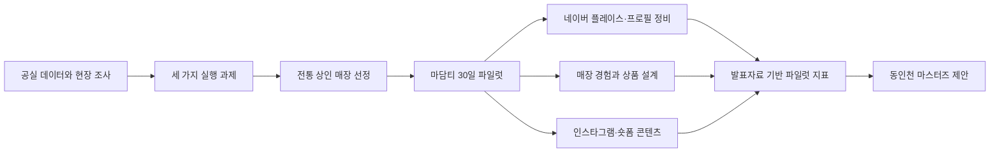

# 동인천 마케팅 파일럿

[English](README.md) · [포트폴리오 케이스 스터디](PORTFOLIO.ko.md)

동인천역 일대 구도심 골목상권을 대상으로 진행한 현장조사·O2O 마케팅 파일럿입니다. Sub-Local 팀은 상권 진단을 바탕으로 전통 찻집 ‘마담티’에서 30일간 파일럿을 실행하고, 이를 확장 가능한 프로그램 제안으로 정리했습니다.

> **근거 경계:** 이 저장소는 소프트웨어나 예측 모델 프로젝트가 아니라 현장 실행·도시재생 프로젝트입니다. 성과 수치는 한 매장에서 관찰한 전후 비교 결과이며, 원본 POS·채널 로그·비교 매장은 저장소에 포함되어 있지 않습니다.

## 프로젝트 개요

| 항목 | 저장소 근거 |
|---|---|
| 맥락 | 2025 PBL 프로그램 자료와 최종 발표자료 |
| 팀 | Sub-Local; 저장소에는 이준형의 역할이 Marketing & Data Analysis로 기록됨 |
| 진단 | 대상 권역 2,612개 점포 중 공실 1,073개(약 40%)라는 발표자료 수치 |
| 파일럿 | 마담티 대상 30일 리브랜딩·O2O 마케팅 실행 |
| 산출물 | 매장 파일럿 케이스와 동인천 마스터즈 프로그램 제안 |

## 문제와 현장 진단

공실률 수치를 출발점으로 현장 방문과 상인 인터뷰를 진행했고, 다음 세 가지 실행 과제를 정리했습니다.

1. **디지털 단절** — 지도·검색·SNS에서 매장을 발견하기 어려움
2. **첫 방문 매력 부족** — 전통 찻집의 공간과 메뉴가 신규 방문객에게 충분히 전달되지 않음
3. **반복 가능한 홍보 경로 부재** — 자체 채널과 콘텐츠 축적 방식이 없음


*그림 1. 공실 시각화는 현장 진단의 출발점을 보여 줍니다. 점포 단위 원본 데이터는 저장소에 없습니다.*

## 파일럿 흐름



## 마담티 30일 파일럿

발견, 방문 경험, 공유가 이어지도록 다음 실행을 묶었습니다.

- 네이버 플레이스 정보·사진·메뉴 정비
- `madam_tea` 인스타그램 개설과 스토리텔링 콘텐츠 제작
- ‘시간을 봉인하는 공간’ 콘셉트 및 씰링왁스 편지 체험 도입
- 발표자료 기준 씰링왁스 편지 2,000원, 예약제 티 오마카세 40,000원 제안

## 발표자료에 기록된 파일럿 결과

| 지표 | 기록된 변화 | 해석 경계 |
|---|---:|---|
| 네이버 리뷰 | 한 달간 신규 4건 | 매장 운영 기록이며 기초 활동값이 완전하게 남아 있지 않음 |
| 평균 월매출 | +25% | 전후 비교 관찰값이며 통제된 증분 효과 추정이 아님 |
| 2030 신규 방문 | +600% | 발표자료 기록값이며 수집 방식·분모가 저장소에 없음 |


*그림 2. 이 시각화는 발표자료에 기록된 변화 요약입니다. 한 매장, 30일 전후 비교 결과이므로 특정 실행 하나의 인과 효과로 해석하지 않습니다.*

## 정책·확장 가능성의 경계

인천광역시 소상공인 정책 부서에 가능성을 문의하고, 학생 크리에이터와 전통 상인을 연결하는 동인천 마스터즈 모델을 제안했습니다. 이는 정책 채택이나 운영 서비스의 증거가 아니라 초기 정책 적합성 검토입니다.

다음 파일럿에서는 기준 기간·POS 추출 규칙·채널별 로그를 고정하고, 30·60·90일 추적과 비교 매장 또는 단계적 도입을 추가해야 합니다.

## 자료 구성

```text
docs/서브로컬팀_PBL_발표자료.pdf                    # 최종 발표자료
docs/[붙임1]2025년 PBL 프로그램 안내문.pdf          # 프로그램·평가 기준
images/vacancy.jpg                                # 진단 시각화
images/results.jpg                                # 파일럿 결과 시각화
```

## 관련 문서

- [포트폴리오 케이스 스터디](PORTFOLIO.ko.md)
- [프로젝트 리뷰](docs/PROJECT_REVIEW.md)
- [CV 활용 가이드](docs/CV_BULLETS.md)
