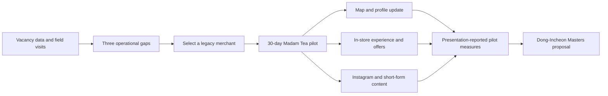

# Dong-Incheon Marketing Pilot

[한국어](README.ko.md) · [Portfolio case study](PORTFOLIO.md)

A field-research and O2O marketing pilot for revitalising legacy alley
commerce around Dong-Incheon Station. The Sub-Local team translated a
commercial-district diagnosis into a 30-day pilot with the traditional tea
shop Madam Tea, then documented the result as a scalable programme proposal.

> **Evidence boundary:** this is an urban-regeneration and field-execution
> project, not a software or predictive-model repository. Outcome figures are
> presentation-reported before/after observations from one store; raw POS,
> channel logs, and a comparison store are not included.

## Project overview

| Item | Evidence in this repository |
|---|---|
| Context | 2025 PBL programme materials and final presentation |
| Team | Sub-Local; the repository records Junhyung Lee as Marketing & Data Analysis |
| Diagnosis | 1,073 vacant stores out of 2,612 in the target area (about 40%), as reported in the presentation |
| Pilot | 30-day rebranding and O2O marketing execution with Madam Tea |
| Output | Store-pilot case study and a proposed Dong-Incheon Masters programme |

## Problem and field diagnosis

The project treated the vacancy statistic as a starting point, then used field
visits and merchant interviews to turn it into three operational gaps:

1. **Digital disconnection** — limited map, search, and social-media presence.
2. **Weak first-visit appeal** — space and menu information did not make the
   traditional-tea experience legible to a new visitor.
3. **No repeatable promotion path** — no owned channel or content loop for
   attracting and retaining attention.


*Figure 1. The retained vacancy visual supports the project's field-diagnosis
starting point. The underlying store-level dataset is not included.*

## Pilot flow



## 30-day Madam Tea pilot

The recorded execution connected discovery, experience, and sharing rather
than relying on a single social-media tactic:

- Updated Naver Place information, photos, and menu details.
- Opened the `madam_tea` Instagram channel and produced storytelling assets.
- Framed the store as a place to “seal time” and introduced a sealing-wax
  letter experience.
- Presented a KRW 2,000 sealing-wax-letter offer and a reservation-only
  KRW 40,000 tea-omakase offer in the project materials.

## Reported pilot results

| Presentation-reported measure | Reported change | Interpretation boundary |
|---|---:|---|
| Naver reviews | 4 new reviews in one month | Store-operation record; baseline activity is not fully retained |
| Average monthly sales | +25% | Before/after observation, not a controlled incrementality estimate |
| New visits from people in their 20s–30s | +600% | Presentation-reported count change; collection method and denominator are absent |


*Figure 2. The retained result visual summarises the reported pilot changes.
It must be read as a one-store, 30-day before/after record, not causal proof
that any one intervention produced the change.*

## Policy and scaling boundary

The project records a feasibility inquiry with the Incheon Metropolitan City
Small Business Policy Division and proposes a repeatable student-merchant
matching model. This is an exploratory policy-feasibility signal, not a city
adoption commitment or a deployed programme.

For a next pilot, preserve baseline definitions, POS extracts, channel-level
logs, and 30/60/90-day follow-up; add a comparable store or staggered rollout
before claiming causal impact.

## Source materials

```text
docs/서브로컬팀_PBL_발표자료.pdf                    # Final presentation
docs/[붙임1]2025년 PBL 프로그램 안내문.pdf          # Programme/evaluation material
images/vacancy.jpg                                # Retained diagnosis visual
images/results.jpg                                # Retained pilot-result visual
```

## Documentation

- [Portfolio case study](PORTFOLIO.md)
- [Project review](docs/PROJECT_REVIEW.md)
- [CV bullet guidance](docs/CV_BULLETS.md)
